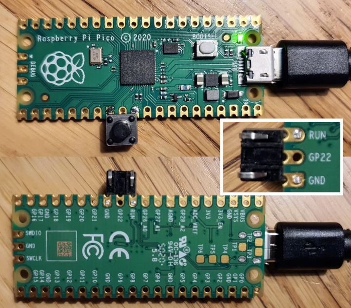
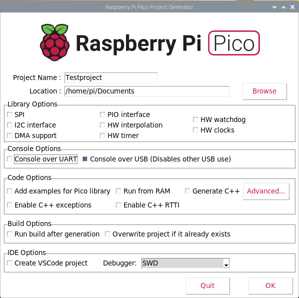

# Compile

This notes explains how to compile with the Pico SDK.


## Pico SDK

First, find the SDK at [https://www.raspberrypi.org/documentation/rp2040/getting-started/](https://www.raspberrypi.org/documentation/rp2040/getting-started/)
and click the "Gettings started C/C++", scroll down to "SDK setup", find
the green bar with "Download Setup Script" - but don't click it.
Instead, right-click and select "Save link as".
I suggest you save the `pico_setup.sh` in your home directory `/home/pi`.
After you have run it, you can delete it.

We need to make the script executable (`chmod +x pico_setup.sh`) and run it.
Note that it installs the whole SDK in a subdirectory `pico` of the
current directory (see script `OUTDIR="$(pwd)/pico"`). So the SDK 
will be installed in `/home/pi/pico`.

Run the script. 
It takes some time (~10min), so I timed it: `time ./pico_setup.sh`.

The script performs a lot of 
[actions](https://datasheets.raspberrypi.org/pico/getting-started-with-pico.pdf#page=5).
This is the resulting tree.

```bash
pi@raspberrypi:~ $ tree -L 1 pico
pico
├── openocd
├── pico-examples
├── pico-extras
├── pico-playground
├── picoprobe
├── pico-sdk
├── picotool
└── vscode.deb
```

The `pico` dir contains `openocd` (On-Chip Debugging), multiple example 
programs in `pico-examples` (like `blink` or `hello_word/usb`), 
libraries that are not yet production quality in `pico_extras` 
and examples that use them in `pico-playground`. I believe 
`picoprobe` is for setting up a second pico as debug probe 
for a first pico. The `pico-sdk` is the core of the 
matter: it provides the headers, libraries and build system 
necessary to write programs for the RP2040-based devices such as 
the Pico in C, C++ or assembly language. `picotool` is a tool for 
inspecting RP2040 binaries, and  interacting with RP2040 devices 
when they are in BOOTSEL mode. This also install Visual Studio Code 
"VS code", or simply `code` in the terminal.

## Pico build

Only a few of the pico-examples are build. To build them all run

```bash
cd pico/
cd pico-examples/
cd build/
make
```

In the `build` directory, we now find a "copy of the tree" of all
examples, but with build generated files only.

```build
pi@raspberrypi:~/pico/pico-examples/build $ cd blink/
pi@raspberrypi:~/pico/pico-examples/build/blink $ ls -al
total 968
drwxr-xr-x  4 pi pi   4096 Mar  7 20:02 .
drwxr-xr-x 30 pi pi   4096 Mar  7 18:53 ..
-rwxr-xr-x  1 pi pi  20088 Mar  7 20:02 blink.bin
-rw-r--r--  1 pi pi 324460 Mar  7 20:02 blink.dis
-rwxr-xr-x  1 pi pi 335060 Mar  7 20:02 blink.elf
-rw-r--r--  1 pi pi 213065 Mar  7 20:02 blink.elf.map
-rw-r--r--  1 pi pi  56568 Mar  7 20:02 blink.hex
-rw-r--r--  1 pi pi  40448 Mar  7 20:02 blink.uf2
drwxr-xr-x  4 pi pi   4096 Mar  7 18:53 CMakeFiles
-rw-r--r--  1 pi pi    988 Mar  7 18:53 cmake_install.cmake
drwxr-xr-x  4 pi pi   4096 Mar  7 18:52 elf2uf2
-rw-r--r--  1 pi pi  76219 Mar  7 18:53 Makefile
```

After inserting the Pico USB plug (while holding down the BOOTSEL button)
in the Pi400, it is mounted as disk in `/media/pi/RPI-RP2/`.

We can copy a generated app (`uf2` file), and the LED should blink.
```bash
pi@raspberrypi:~/pico/pico-examples/build/blink $ cp blink.uf2 /media/pi/RPI-RP2/
```

We can also change the blink example, e.g. changing the blink frequency. 
I GUESS YOU SHOULD NOT DO THAT - CHANGING the STOCK EXAMPLES.

```bash
pi@raspberrypi:~/pico/pico-examples/build $ cd ../blink/
pi@raspberrypi:~/pico/pico-examples/blink $ vi blink.c 
pi@raspberrypi:~/pico/pico-examples/blink $ cd ../build/
pi@raspberrypi:~/pico/pico-examples/build $ make
[  0%] Built target bs2_default
...
Scanning dependencies of target blink
[  0%] Building C object blink/CMakeFiles/blink.dir/blink.c.obj
[  0%] Linking CXX executable blink.elf
[  1%] Built target blink
[  2%] Built target hello_serial
[  4%] Built target hello_usb
...
[100%] Built target hello_watchdog
pi@raspberrypi:~/pico/pico-examples/build $ 
```

And run that by copying the `blink.uf2` to the "mass storage device".
```bash
pi@raspberrypi:~/pico/pico-examples/build/blink $ cp blink.uf2 /media/pi/RPI-RP2/
```

Recall, to get the mass storage device 
insert the Pico USB plug while holding down the BOOTSEL button.

Replugging the USB cable is such a hassle that I added
a reset button myself.




## Own program

To create our own program, easiest way to start is starting from
an empty template. We can clone the template generator.

```bash
pi@raspberrypi:~/pico/pico-examples $ cd
pi@raspberrypi:~ $ mkdir bin
pi@raspberrypi:~ $ cd bin
pi@raspberrypi:~/bin $  git clone https://github.com/raspberrypi/pico-project-generator.git
Cloning into 'pico-project-generator'...
remote: Enumerating objects: 95, done.
remote: Counting objects: 100% (95/95), done.
remote: Compressing objects: 100% (65/65), done.
remote: Total 95 (delta 55), reused 56 (delta 29), pack-reused 0
Unpacking objects: 100% (95/95), done.
pi@raspberrypi:~/bin $ ls
pico-project-generator
pi@raspberrypi:~/bin $ cd pico-project-generator/
pi@raspberrypi:~/bin/pico-project-generator $ ls
logo_alpha.gif  pico_configs.tsv  pico_project.py  README.md
pi@raspberrypi:~/bin/pico-project-generator $ ./pico_project.py --gui
```



What is generated is not overdone.

```bash
pi@raspberrypi:~/Documents/Testproject $ ls -al
total 24
drwxr-xr-x 3 pi pi 4096 Mar  7 20:54 .
drwxr-xr-x 3 pi pi 4096 Mar  7 20:54 ..
drwxr-xr-x 6 pi pi 4096 Mar  7 20:54 build
-rw-r--r-- 1 pi pi  856 Mar  7 20:54 CMakeLists.txt
-rw-r--r-- 1 pi pi 2763 Mar  7 20:54 pico_sdk_import.cmake
-rw-r--r-- 1 pi pi  126 Mar  7 20:54 Testproject.c
```

The `build` directory contains all generated files. 
`CMakeLists.txt` is the input for `cmake` to generate the `makefile`. 
It uses `pico_sdk_import.cmake`.
The actual c-source is `Testproject.c`.

If you want, this can be simplified.
The `build` directory can be deleted; it is completed regenerated by `make`.
The file `pico_sdk_import.cmake` is a copy of `/home/pi/pico/pico-sdk/external/pico_sdk_import.cmake`.
So, we can delete that file, and edit `CMakeLists.txt` to use the original.
Replace
```
include(pico_sdk_import.cmake)
```

by 

```
include(/home/pi/pico/pico-sdk/external/pico_sdk_import.cmake)
```

So, after this cleanup we have

```bash
pi@raspberrypi:~/Documents/Testproject $ vi CMakeLists.txt 
pi@raspberrypi:~/Documents/Testproject $ rm pico_sdk_import.cmake 
pi@raspberrypi:~/Documents/Testproject $ rm -rf build
pi@raspberrypi:~/Documents/Testproject $ ls -al
total 16
drwxr-xr-x 2 pi pi 4096 Mar  7 21:02 .
drwxr-xr-x 3 pi pi 4096 Mar  7 20:54 ..
-rw-r--r-- 1 pi pi  888 Mar  7 21:01 CMakeLists.txt
-rw-r--r-- 1 pi pi  128 Mar  7 21:02 Testproject.c
```

Let's build. Note that the last command copys the uf2 file, so bring the
pico in mass storage mode first

```bash
pi@raspberrypi:~/Documents/Testproject $ mkdir build
pi@raspberrypi:~/Documents/Testproject $ cd build/
pi@raspberrypi:~/Documents/Testproject/build $ cmake ..
PICO_SDK_PATH is /home/pi/pico/pico-sdk
...
-- Build files have been written to: /home/pi/Documents/Testproject/build
pi@raspberrypi:~/Documents/Testproject/build $ make -j4
Scanning dependencies of target ELF2UF2Build
Scanning dependencies of target bs2_default
[  1%] Creating directories for 'ELF2UF2Build'
...
[100%] Linking CXX executable Testproject.elf
[100%] Built target Testproject
pi@raspberrypi:~/Documents/Testproject/build $ cp *.uf2 /media/pi/RPI-RP2/
```


