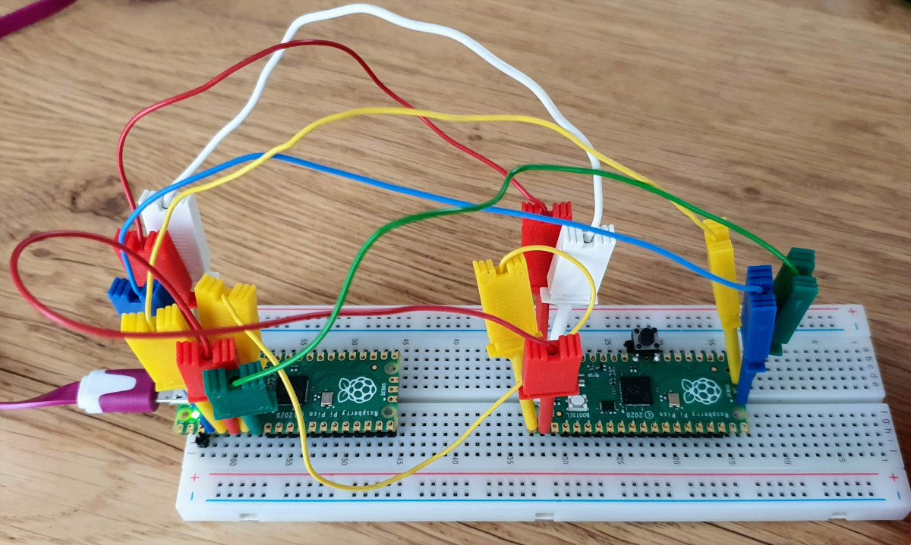

# Debugging

This document describes how to debug a Raspberry Pi Pico
from a Raspberry Pi 400 using a second Pico as SWD probe 
and VS code as IDE.

## Context

The diagram below (made with [draw.io](draw.io)) shows all components needed for debugging.


## Step 0: Getting started

As a host, I'm using Raspberry Pi 400.
I started this setup process with a complete fresh Pi 400 image.

The key document for this experiment is [getting-started-with-pico.pdf](getting-started-with-pico.pdf)
which can be found on [https://datasheets.raspberrypi.org/](https://datasheets.raspberrypi.org/).
I downloaded that first. I have version `build-date: 2021-03-05` and `build-version: 9bf4a25-clean`.

## Step 1: Install Pico SDK

As the document explains "most of the installation steps in this Getting Started guide can be skipped by running the setup script".
That's what we do.

```text
pi@raspberrypi:~ $ pwd
/home/pi
pi@raspberrypi:~ $ wget https://raw.githubusercontent.com/raspberrypi/pico-setup/master/pico_setup.sh
...
pi@raspberrypi:~ $ chmod +x pico_setup.sh
pi@raspberrypi:~ $ ./pico_setup.sh
...
pi@raspberrypi:~ $
```

This takes around 15 minutes and installs all necesary components.

```text
pi@raspberrypi:~ $ tree -L 1 pico
pico
├── openocd
├── pico-examples
├── pico-extras
├── pico-playground
├── picoprobe
├── pico-sdk
├── picotool
└── vscode.deb
```

## Step 2: Example project

I created a project that prints some text over uart (the real one, not over USB)
and blinks the LED. The project consists of two files, a c-source `UartLed.c`
and a cmake file `CMakeLists.txt`. Copy the directory `UartLed` from the
[repo](UartLed) to e.g. the `Documents` directory on the Pi400.

Note that the `CMakeList.txt` configures stdio to use `uart` and not `usb`.
The reason is that the probe also allows briding the UART.

```text
pico_enable_stdio_uart(UartLed 1)
pico_enable_stdio_usb(UartLed 0)
```

We initiate the build process.

```text
pi@raspberrypi:~/Documents $ cd UartLed/
pi@raspberrypi:~/Documents/UartLed $ ls
CMakeLists.txt  UartLed.c
pi@raspberrypi:~/Documents/UartLed $ mkdir build
pi@raspberrypi:~/Documents/UartLed $ cd build
pi@raspberrypi:~/Documents/UartLed/build $ cmake ..
...
-- Build files have been written to: /home/pi/Documents/UartLed/build
pi@raspberrypi:~/Documents/UartLed/build $ make -j4
...
[100%] Built target UartLed
pi@raspberrypi:~/Documents/UartLed/build $ 
```

Successful build, resulting in several binaries.

```text
pi@raspberrypi:~/Documents/UartLed/build $ ls -al
total 888
drwxr-xr-x 6 pi pi   4096 Mar 15 21:06 .
drwxr-xr-x 3 pi pi   4096 Mar 15 21:05 ..
-rw-r--r-- 1 pi pi  19004 Mar 15 21:06 CMakeCache.txt
drwxr-xr-x 5 pi pi   4096 Mar 15 21:06 CMakeFiles
-rw-r--r-- 1 pi pi   1543 Mar 15 21:06 cmake_install.cmake
drwxr-xr-x 6 pi pi   4096 Mar 15 21:06 elf2uf2
drwxr-xr-x 3 pi pi   4096 Mar 15 21:06 generated
-rw-r--r-- 1 pi pi  71917 Mar 15 21:06 Makefile
drwxr-xr-x 6 pi pi   4096 Mar 15 21:06 pico-sdk
-rwxr-xr-x 1 pi pi  23132 Mar 15 21:06 UartLed.bin
-rw-r--r-- 1 pi pi 423364 Mar 15 21:06 UartLed.dis
-rwxr-xr-x 1 pi pi 160936 Mar 15 21:06 UartLed.elf
-rw-r--r-- 1 pi pi 155982 Mar 15 21:06 UartLed.elf.map
-rw-r--r-- 1 pi pi  65126 Mar 15 21:06 UartLed.hex
-rw-r--r-- 1 pi pi  46592 Mar 15 21:06 UartLed.uf2
```

The important ones are `UartLed.uf2` and `UartLed.elf`.
The former is needed when going old style: copying to the Pico
in mass storage mode. We need the `elf` file later for SWD upload.

## Step 4: Upload UartLed firmware

It might be a good moment to test that the `UartLed.uf2` works.
Keep the BOOTSEL button of the Pico down while plugging its
USB plug in the Pi 400, then release the BOOTSEL.

A pop up should appear notifying that a `RPI-RP2` disk is mounted. 
Close the pop-up.
The disk is the Pico, which is in mass storage mode because we booted
with the BOOTSEL pressed. It is mounted at `/media/pi/RPI-RP2/`, and
it also has a short-cut on the Desktop. We will use the former.

```text
pi@raspberrypi:~/Documents/UartLed/build $ cp UartLed.uf2 /media/pi/RPI-RP2/
```

This writes the uf2 file to the pico and reboots it.
We should see the LED flash.

## Step 5: Upload picoprobe firmware

Next step is to upload the picoprobe firmware.
Picoprobe is downloaded and build as part of the Pico SDk script.

So again, keep the BOOTSEL button of the Pico down while plugging its
USB plug in the Pi 400, then release the BOOTSEL. 
Now copy the picoprobe firmware to the pico.

```text
pi@raspberrypi:~ $ cd ~/pico/picoprobe/build/
pi@raspberrypi:~/pico/picoprobe/build $ cp picoprobe.uf2 /media/pi/RPI-RP2/
```

## Step 6: Wire the hardware

TODO: schematics



## Step 7: SWD upload and udev rules

Let's no try to upload the UartLed via the picoprobe to the target pico.

```text
pi@raspberrypi:~/Documents/UartLed/build $ openocd  -f interface/picoprobe.cfg  -f target/rp2040.cfg  -c "program UartLed.elf verify reset exit"
...
Error: libusb_open() failed with LIBUSB_ERROR_ACCESS
Error: Failed to open or find the device
Error: Can't find a picoprobe device! Please check device connections and permissions.
Error: No Valid JTAG Interface Configured.
```

Something is wrong. We have an ACCESS error.
If we run the above command as `sudo` it does execute succesfully!
We need t make sure the `pi` user is allowed to access the picoprobe.

We need to add a udev rule. What is our device?

```text
pi@raspberrypi:~/pico/picoprobe/build $ lsusb
Bus 002 Device 001: ID 1d6b:0003 Linux Foundation 3.0 root hub
Bus 001 Device 005: ID 04d9:0007 Holtek Semiconductor, Inc. 
Bus 001 Device 004: ID 046d:c016 Logitech, Inc. Optical Wheel Mouse
Bus 001 Device 012: ID 2e8a:0004  
Bus 001 Device 002: ID 2109:3431 VIA Labs, Inc. Hub
Bus 001 Device 001: ID 1d6b:0002 Linux Foundation 2.0 root hub
```

Our device is `2e8a:0004` which is confirmed by unplugging the
picoprobe and re-inserting it.

We need to create a file `12-picoprobe.rules` ("random name") in
`/usr/lib/udev_rules.d`.

```text
pi@raspberrypi:~/pico/picoprobe/build $ sudo vi /usr/lib/udev/rules.d/12-picoprobe.rules
```

This is the udev rule I created: I couple the vedor and product id to giving the device "chmod flags" 644 and group id "plugdev", a group that `pi` is member of.

```text
# Maarten: rules for PicoProbe
ATTRS{idVendor}=="2e8a", ATTRS{idProduct}=="0004", MODE="664", GROUP="plugdev"
```

Plug and unplug the picoprobe, and retry the `openocd` command without sudo!

## Step 8: serial over picoprobe

Remember that the `Uartled` program did `printf, and that we configured stdio to map hardware uart? The hardware uart (uart0) of the target pico is wired to the
hardware uart of the picoprobe (uart1). Furthermore the picoprobe has a piece of software that bridges uart1 to usb. Finally, the picoprobe usb surfaces as two services on the Pi400: SWD and UART.

Open the serial port

```text
minicom -b 115200 -o -D /dev/ttyACM0
```

We see the counted messages from `Uartled`.

```
Welcome to minicom 2.7.1

OPTIONS: I18n 
Compiled on Aug 13 2017, 15:25:34.
Port /dev/ttyACM0, 23:27:21

Press CTRL-A Z for help on special keys

Message 733
Message 734
Message 735
Message 736
Message 737
Message 738
Message 739
```

Exit with ctrl-A x return.

(end)
