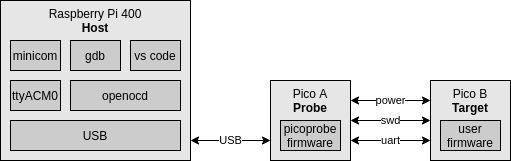
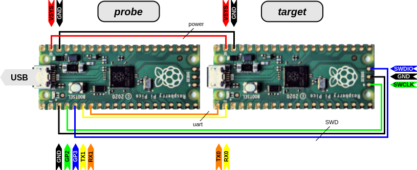

# Debugging

This document describes how to debug a Raspberry Pi Pico
from a Raspberry Pi 400 using a second Pico as SWD probe ("PicoProbe")
and VS code as IDE.

## Context

The diagram below (made with [draw.io](draw.io)) shows all components needed for debugging.



On the right we find Pico B, the **target** device. This is the pico for which we develop software. It will run the _user firmware_, for example "blinky with printf". The printf's are typically mapped to the hardware UART of Pico B.

Pico A is the _debug adapter_ or **probe**. It not only _powers_ Pico B, but also fully controls Pico B using the SWD wires. Thirdly, Pico A bridges the UART of Pico B over USB to the host. The SWD control and UART bridging is implemented in picoprobe firmware which can be downloaded and flashed to Pico A.

The **host**, in this readme assumed to be a raspberry pi 400, connects to the Pico A using USB. The Pico A surfaces as two devices on the host: a serial port (typically `/dev/ttyACM0`) which is the bridged UART from Pico B, and a probe (some USB device - unclear to me).

On the host we run OpenOCD. It has build-in knowledge of several probes including picoprobe. It implements two **servers**: telnet and gdb. As developement tool, we use Visual Studio Code, which acts as a gdb client.

This document goes through the steps of implementing what is depicted in the diagram.

## Step 0: Getting started

As a host, I'm using Raspberry Pi 400.
I started this setup process with a complete fresh Pi 400 image.

The key document for this experiment is [getting-started-with-pico.pdf](getting-started-with-pico.pdf)
which can be found on [https://datasheets.raspberrypi.org/](https://datasheets.raspberrypi.org/).
I downloaded that first. I have version `build-date: 2021-03-05` and `build-version: 9bf4a25-clean`. At the moment of writing this page, that document is still changing frequently.

## Step 1: Install Pico SDK

As the document explains
_"most of the installation steps in this Getting Started guide can be skipped by running the setup script"._
That's what we do: we run `pico_setup.sh`. Note that the pico SDK is installed in a new directory `pico` that
will be created in the directory where we run the setup script.

```text
pi@raspberrypi:~ $ pwd
/home/pi
pi@raspberrypi:~ $ wget https://raw.githubusercontent.com/raspberrypi/pico-setup/master/pico_setup.sh
...
pi@raspberrypi:~ $ chmod +x pico_setup.sh
pi@raspberrypi:~ $ ./pico_setup.sh
...
pi@raspberrypi:~ $
```

The last command takes around 15 minutes and installs all necesary SDK components. Let's inspect that.

```text
pi@raspberrypi:~ $ tree -L 1 pico
pico
├── openocd
├── pico-examples
├── pico-extras
├── pico-playground
├── picoprobe
├── pico-sdk
├── picotool
└── vscode.deb
```

By the way `pico_setup.sh` also adds some environment variables (see `.bashrc`).

## Step 2: Example project

I created a project that prints some text over uart and blinks the LED.
The project consists of two files, a c-source `UartLed.c`
and a cmake file `CMakeLists.txt`. Copy the directory `UartLed` from the
[repo](UartLed) to e.g. the `Documents` directory on the Pi 400. It is just a test
program, you can delete it later.

Note that the `CMakeList.txt` configures stdio to use `uart` (i.e. uart0) and not `usb`.

```text
pico_enable_stdio_uart(UartLed 1)
pico_enable_stdio_usb(UartLed 0)
```

The reason is that the probe also allows bridging the UART, and we want to test that.

We initiate the build process of our project: create the `build` directory, run `cmake` and `make`:

```text
pi@raspberrypi:~/Documents $ cd UartLed/
pi@raspberrypi:~/Documents/UartLed $ ls
CMakeLists.txt  UartLed.c
pi@raspberrypi:~/Documents/UartLed $ mkdir build
pi@raspberrypi:~/Documents/UartLed $ cd build
pi@raspberrypi:~/Documents/UartLed/build $ cmake ..
...
-- Build files have been written to: /home/pi/Documents/UartLed/build
pi@raspberrypi:~/Documents/UartLed/build $ make -j4
...
[100%] Built target UartLed
pi@raspberrypi:~/Documents/UartLed/build $ 
```

Successful build, resulting in several binaries.

```text
pi@raspberrypi:~/Documents/UartLed/build $ ls -al
total 888
drwxr-xr-x 6 pi pi   4096 Mar 15 21:06 .
drwxr-xr-x 3 pi pi   4096 Mar 15 21:05 ..
-rw-r--r-- 1 pi pi  19004 Mar 15 21:06 CMakeCache.txt
drwxr-xr-x 5 pi pi   4096 Mar 15 21:06 CMakeFiles
-rw-r--r-- 1 pi pi   1543 Mar 15 21:06 cmake_install.cmake
drwxr-xr-x 6 pi pi   4096 Mar 15 21:06 elf2uf2
drwxr-xr-x 3 pi pi   4096 Mar 15 21:06 generated
-rw-r--r-- 1 pi pi  71917 Mar 15 21:06 Makefile
drwxr-xr-x 6 pi pi   4096 Mar 15 21:06 pico-sdk
-rwxr-xr-x 1 pi pi  23132 Mar 15 21:06 UartLed.bin
-rw-r--r-- 1 pi pi 423364 Mar 15 21:06 UartLed.dis
-rwxr-xr-x 1 pi pi 160936 Mar 15 21:06 UartLed.elf
-rw-r--r-- 1 pi pi 155982 Mar 15 21:06 UartLed.elf.map
-rw-r--r-- 1 pi pi  65126 Mar 15 21:06 UartLed.hex
-rw-r--r-- 1 pi pi  46592 Mar 15 21:06 UartLed.uf2
```

The important ones are `UartLed.uf2` and `UartLed.elf`.
The former is needed when going old style: copying to the Pico
in mass storage mode. We need the `elf` file later for SWD upload.

## Step 3: Upload UartLed firmware

It might be a good moment to test that the `UartLed.uf2` works.
Keep the BOOTSEL button of the Pico down while plugging its
USB plug in the Pi 400, then release the BOOTSEL.

A pop up should appear notifying that a `RPI-RP2` disk is mounted. 
Close the pop-up.
The disk is the Pico, which is in mass storage mode because we booted
with the BOOTSEL pressed. It is mounted at `/media/pi/RPI-RP2/`, and
it also has a short-cut on the Desktop. We will use the former.

```text
pi@raspberrypi:~/Documents/UartLed/build $ cp UartLed.uf2 /media/pi/RPI-RP2/
```

This writes the uf2 file (from the build) to the pico and reboots it.
We should see the LED flash.

## Step 4: Upload picoprobe firmware

Next step is to upload the picoprobe firmware.
Picoprobe was downloaded and build as part of the Pico SDK script.

So again, keep the BOOTSEL button of the Pico down while plugging its
USB plug in the Pi 400, then release the BOOTSEL.
Now copy the picoprobe firmware to the pico.

```text
pi@raspberrypi:~ $ cd ~/pico/picoprobe/build/
pi@raspberrypi:~/pico/picoprobe/build $ cp picoprobe.uf2 /media/pi/RPI-RP2/
```

This pico now has the picoprobe firmware. Mark it as such.

## Step 5: Wire the hardware

Now wire a second pico, the "target" to the just created picoprobe.



Find below my actual wiring. I have a very limited assortment of clip-wires, so I couldn't match up the colors to the schematics.


## Step 6: SWD upload and udev rules

Let's now try to upload the UartLed via the _picoprobe_ to the target pico.

```text
pi@raspberrypi:~/Documents/UartLed/build $ openocd  -f interface/picoprobe.cfg  -f target/rp2040.cfg  -c "program UartLed.elf verify reset exit"
...
Error: libusb_open() failed with LIBUSB_ERROR_ACCESS
Error: Failed to open or find the device
Error: Can't find a picoprobe device! Please check device connections and permissions.
Error: No Valid JTAG Interface Configured.
```

Something is wrong. We have an ACCESS error.
If we run the above command as `sudo` it does execute succesfully!
We need to make sure the `pi` user is allowed to access the picoprobe.

We need to add a udev rule. What is our device?

```text
pi@raspberrypi:~/pico/picoprobe/build $ lsusb
Bus 002 Device 001: ID 1d6b:0003 Linux Foundation 3.0 root hub
Bus 001 Device 005: ID 04d9:0007 Holtek Semiconductor, Inc. 
Bus 001 Device 004: ID 046d:c016 Logitech, Inc. Optical Wheel Mouse
Bus 001 Device 012: ID 2e8a:0004  
Bus 001 Device 002: ID 2109:3431 VIA Labs, Inc. Hub
Bus 001 Device 001: ID 1d6b:0002 Linux Foundation 2.0 root hub
```

Our device is `2e8a:0004` which is confirmed by unplugging the
picoprobe and re-inserting it.

We need to "whitelist" this device in udev.
We create a file `12-picoprobe.rules` ("random name") in
`/usr/lib/udev_rules.d`.

```text
pi@raspberrypi:~/pico/picoprobe/build $ sudo vi /usr/lib/udev/rules.d/12-picoprobe.rules
```

This is the udev rule I created: I couple the vendor and product id
to giving the device "chmod flags" 644 and group id "plugdev",
a group that `pi` is member of.

```text
# Maarten: rules for PicoProbe
ATTRS{idVendor}=="2e8a", ATTRS{idProduct}=="0004", MODE="664", GROUP="plugdev"
```

Plug and unplug the picoprobe, and retry the `openocd` command without sudo.
It should now work.

```text
pi@raspberrypi:~/Documents/UartLed/build $ openocd  -f interface/picoprobe.cfg  -f target/rp2040.cfg  -c "program UartLed.elf verify reset exit"
Open On-Chip Debugger 0.10.0+dev-geb22ace-dirty (2021-03-15-20:54)
...
** Programming Started **
...
** Programming Finished **
** Verify Started **
...
** Verified OK **
** Resetting Target **
shutdown command invoked
pi@raspberrypi:~/Documents/UartLed/build $
```

## Intermezzo A: understanding OpenOCD

This is a long section, but you can skip it.
We experiment with `openocd`, and two clients: `telnet` and `gdb`.

### Telnet client

In the previous section, we gave an openocd command.
If we look it it carefully, we see that it consists has three arguments:
`-f interface/picoprobe.cfg`, `-f target/rp2040.cfg`, and `-c "program UartLed.elf verify reset exit"`.

Those arguments have a lot in common. Openocd has a command interpreter, and the `-f` option feeds a text file with commands to openocd. We see that two of of the arguments have that form. The first feeds commands to inform openocd what kind of _probe_ is installed. The second file feeds commands to inform openocd what kind of _target_ is behind the probe. The third is an _inline_ command.

As an experiment, open a second terminal and run openocd without the inline command: `openocd  -f interface/picoprobe.cfg  -f target/rp2040.cfg`. This starts openocd, but without the commands, it doesn't stop.
Instead, as the ouput shows, it opens servers.

```text
pi@raspberrypi:~ $ openocd  -f interface/picoprobe.cfg  -f target/rp2040.cfg 
Open On-Chip Debugger 0.10.0+dev-geb22ace-dirty (2021-03-15-20:54)
...
Info : Listening on port 6666 for tcl connections
Info : Listening on port 4444 for telnet connections
...
Info : Listening on port 3333 for gdb connections
```

The interesting one for now is the telnet server. Start a telnet client (you may need to install one first `sudo apt-get install telnet`) in
another terminal. I suggest to change the LED blink frequency in UartLed.c and re-`make` that project first. Then we load the binary via the telnet client.

```text
pi@raspberrypi:~/Documents/UartLed/build $ telnet localhost 4444
...
> program /home/pi/Documents/UartLed/build/UartLed.elf
...
** Programming Finished **
> reset
> exit
Connection closed by foreign host.
pi@raspberrypi:~/Documents/UartLed/build $ 
```

### OpenOCD details

We can also check which _adapters_ (openocd term for probes) and _transports_ (openocd term for interface types) are supported by the openocd on our host.

```text
pi@raspberrypi:~/Documents/UartLed/build $ telnet localhost 4444
...
> adapter list
The following debug adapters are available:
1: ftdi
2: usb_blaster
3: ft232r
4: presto
5: usbprog
6: openjtag
7: jlink
8: vsllink
9: rlink
10: ulink
11: arm-jtag-ew
12: hla
13: osbdm
14: opendous
15: sysfsgpio
16: aice
17: bcm2835gpio
18: picoprobe
19: xds110
20: st-link

> transport list
The following transports are available:
	swd
	dapdirect_swd
	dapdirect_jtag
	swim
	aice_jtag
	hla_jtag
	hla_swd
	jtag

> exit
Connection closed by foreign host.
```

We see that `picoprobe` (18) support is hardwired into openocd (probably upon request of the raspberry foundation). That `swd` is supported is less of a surprise; itt is an older standard supported by ARM.

If we check the first command file we send to openocd we see it is a short file selecting the `adapter driver`, `adapter speed` and the `transport`.

```text
pi@raspberrypi:/usr/local/bin $ cat /usr/local/share/openocd/scripts/interface/picoprobe.cfg
# Adapter section
adapter driver picoprobe
transport select swd
adapter speed 5000
pi@raspberrypi:/usr/local/bin $
```

The other file make much less sense to me. But we do see the `rp2040` listed with two CPUs.

```text
pi@raspberrypi:~/Documents/UartLed/build $ cat /usr/local/share/openocd/scripts/target/rp2040.cfg 
source [find target/swj-dp.tcl]
source [find mem_helper.tcl]

set _CHIPNAME rp2040
set _CPUTAPID 0x01002927
set _ENDIAN little

swj_newdap $_CHIPNAME.core0 cpu -dp-id $_CPUTAPID -instance-id 0
swj_newdap $_CHIPNAME.core1 cpu -dp-id $_CPUTAPID -instance-id 1
...
set _FLASHNAME $_CHIPNAME.flash
...
```

### GDB 
You might have noticed the openocd not only starts a telnet server, but also a gdb server. That means we can also talk to openocd with a gdb client instead of a telnet client. Let's try to use gdb to flash (and debug). I assume that the telnet client is `exit`ed, but the openocd is still running in the other terminal.

Let's first change the LED blink frequency in UartLed.c and re-`make` that project first.

Next run the gdb client (if you installed the full pico SDK you have it, otherwise run `sudo apt install gdb-multiarch`).

```text
pi@raspberrypi:~/Documents/UartLed/build $ gdb UartLed.elf 
```

Connect to the gdb server in openocd.

```text
(gdb) target remote localhost:3333
```

Load the binary with the debug symbols.

```text
(gdb) load
Loading section .boot2, size 0x100 lma 0x10000000
Loading section .text, size 0x4128 lma 0x10000100
Loading section .rodata, size 0xd28 lma 0x10004228
Loading section .binary_info, size 0x28 lma 0x10004f50
Loading section .data, size 0x1e0 lma 0x10004f78
Start address 0x100001e8, load size 20824
Transfer rate: 6 KB/sec, 3470 bytes/write.
```

Reset and start the application.

```text
(gdb) monitor reset init
```

The app is reset, but halted. We must explicitly start it.

```test
(gdb) continue
Continuing.
```

To pause the program, issue a `^C`.
The program halt somewhere deep in a timer library (the impementation of `sleep_ms()`).

```test
^C
target halted due to debug-request, current mode: Thread 
...
110	    uint32_t hi = timer_hw->timerawh;
```

Let's set a breakpoint at the first line of the blink loop (line 23 in file `UartLed.c`).

```text
(gdb) break UartLed.c:23
Breakpoint 1 at 0x10000384: file /home/pi/Documents/UartLed/UartLed.c, line 24.
```

And we continue the program (we abbreviate `continue` to `c`).

```text
(gdb) c
Continuing.
```

We see the LED blink once and then the breakpoint hits.

```text
Thread 1 hit Breakpoint 1, main () at /home/pi/Documents/UartLed/UartLed.c:24
24	        sleep_ms(500);
```

We can do this is couple of times.
If we want we can inspect variables.

```text
(gdb) print count
$1 = 6
```

If we continues once and then `print count` again, we see it is one higher.

```text
(gdb) c
Continuing.
target halted due to debug-request, current mode: Thread 
xPSR: 0x01000000 pc: 0x0000012a msp: 0x20041f00

Thread 1 hit Breakpoint 1, main () at /home/pi/Documents/UartLed/UartLed.c:24
24	        sleep_ms(500);
(gdb) print count
$2 = 7
```

We can also inspect where all breakpoints are set with the `break` command.

```text
(gdb) break
Note: breakpoint 1 also set at pc 0x10000384.
Breakpoint 2 at 0x10000384: file /home/pi/Documents/UartLed/UartLed.c, line 24.
```

For more inspiration enter `help`.

```text
(gdb) help
List of classes of commands:

aliases -- Aliases of other commands
breakpoints -- Making program stop at certain points
data -- Examining data
files -- Specifying and examining files
internals -- Maintenance commands
obscure -- Obscure features
running -- Running the program
stack -- Examining the stack
status -- Status inquiries
support -- Support facilities
tracepoints -- Tracing of program execution without stopping the program
user-defined -- User-defined commands

Type "help" followed by a class name for a list of commands in that class.
Type "help all" for the list of all commands.
Type "help" followed by command name for full documentation.
Type "apropos word" to search for commands related to "word".
Command name abbreviations are allowed if unambiguous.
```

Finally we quit gdb client.

```text
(gdb) quit
A debugging session is active.

	Inferior 1 [Remote target] will be detached.

Quit anyway? (y or n) y
Detaching from program: /home/pi/Documents/UartLed/build/UartLed.elf, Remote target
Ending remote debugging.
[Inferior 1 (Remote target) detached]
pi@raspberrypi:~/Documents/UartLed/build $ 
```

## Step 7: Serial over picoprobe

Remember that the `UartLed` program did `printf`, and that we configured `stdio` 
to map to the hardware uart? The hardware uart (uart0) of the target pico is wired to the
hardware uart of the picoprobe (uart1). 
Furthermore the picoprobe has a piece of software that bridges uart1 to usb. 
Finally, the picoprobe usb surfaces as two services on the Pi400: SWD and UART.

Open the serial port

```text
minicom -b 115200 -o -D /dev/ttyACM0
```

We see the counted messages from `UartLed`.

```text
Welcome to minicom 2.7.1

OPTIONS: I18n 
Compiled on Aug 13 2017, 15:25:34.
Port /dev/ttyACM0, 23:27:21

Press CTRL-A Z for help on special keys

Message 733
Message 734
Message 735
Message 736
Message 737
Message 738
Message 739
```

Exit with ctrl-A x return.

## Step 8: VS Code

We will now switch to VS Code. Visual Studio code is installed by the SDK setup script.
VS code needs a coupe of extensions, but also these are all installed by the SDK setup script.
 - `ms-vscode.cpptools`
   adds language support for C/C++ to Visual Studio Code, 
   including features such as IntelliSense and debugging.
 - `ms-vscode.cmake-tools`
   provides a workflow for CMake-based projects in Visual Studio Code.
   It presumably depends on the extension `twxs.cmake`
   which provides support for CMake in Visual Studio Code.
 - `marus25.cortex-debug`
   provides debugging support for ARM Cortex-M Microcontrollers 
   using OpenOCD GDB Server.

You should find these in the Side Bar (black bar that is by default on the left)
in the fifth option `Extensions`.

Note that there is a directory `~/.vscode` with per user settings.
Most notably, it contains the installed extensions.

I suggest to remove the `build` directory of `UartLed` project.

I open vscode by typing `code` in the directory `/home/pi/Documents/UartLed` in a terminal.
Maybe you can also right click on the project directory in the file manager
and select "Visual Studio Code" from the context menu. But I'm not sure 
that the `PICO_SDK_PATH` is then set, because that is loaded by bash (`~/.bashrc`) in a terminal.

I get a couple of puzzling pop-ups.
 - A notification.
   `Would you like to configure project 'UartLed'?` from `Source: CMake Tools (Extension)`.
   I pressed yes.
 - A follow up notification from the same extension `Always configure projects upon opening?`.
   I also pressed yes. I presume that answering "Yes" here means that the previous
   question is from now on no longer asked for CMake projects; it defaults to yes.
 - A third notification. 
   `Configure your IntelliSense settings to help find missing headers.`
 - A fourth one. 
   `Insiders version 1.3.0-insiders is available. Would you like to switch to the Insiders channel and install this update?`  
   No Idea what it means. Pressed "Yes"
 - Finally, I get a "Select a Kit for UartLed". That question appears in a top-bar;
   it is not a notification like before. It also disapears easily. But you can
   get it back by clicking in the status bar (bottom) where it says
   `CMake: [Debug]: Ready`. I selected `GCC for arm-none-eabi 7.3.1`.
 - A follow-up question pops up, which asks for a build configuration; I selected `Debug`.
   After this, we see that a `build` directory is automatically generates.
 - Note that by pressing `Build` in the status bar, a new build is started.
   By Pressing `CMake: [Debug]: Ready` we can switch to `Release`.
   But probably `Debug` is better for symbols generated for the debugger.

For running (debgging) we need to link vscode to openocd/gdb.
As the `getting-started-with-pico.pdf` explains.
_The SDK contains an debug configuration that will start OpenOCD, 
attach GDB, and finally launch the application. It also provides a 
settings file, which removes some potentially confusing options from 
the CMake plugin (including broken Debug and Run buttons that attempt 
to run a Pico binary on the host)._

We exit `code` and create a `.vscode` directory with two config files.

```text
pi@raspberrypi:~/Documents/UartLed $ mkdir .vscode
pi@raspberrypi:~/Documents/UartLed $ cp ~/pico/pico-examples/ide/vscode/launch-raspberrypi-swd.json .vscode/launch.json
pi@raspberrypi:~/Documents/UartLed $ cp ~/pico/pico-examples/ide/vscode/settings.json .vscode/settings.json
pi@raspberrypi:~/Documents/UartLed $ 
```

We need to patch the configuration, because the interface by default is Pi 400 not picoprobe.
So change

```text
"configFiles": [
 "interface/raspberrypi-swd.cfg",
 "target/rp2040.cfg"
]
```

to

```text
"configFiles": [
 "interface/picoprobe.cfg",
 "target/rp2040.cfg"
]
```

The we restart `code` in our project dierctory.

```text
pi@raspberrypi:~/Documents/UartLed $ ls -al
total 24
drwxr-xr-x 4 pi pi 4096 Mar 21 22:34 .
drwxr-xr-x 3 pi pi 4096 Mar 21 21:18 ..
drwxr-xr-x 7 pi pi 4096 Mar 21 22:27 build
-rw-r--r-- 1 pi pi  847 Mar 15 21:05 CMakeLists.txt
-rw-r--r-- 1 pi pi  619 Mar 21 19:17 UartLed.c
drwxr-xr-x 2 pi pi 4096 Mar 21 22:36 .vscode
pi@raspberrypi:~/Documents/UartLed $ code
```

In the Side Bar click the Run and Debug (4th from the top)
and press the Start debugging green rectangle at the top.

The OUTPUT will show the compilation.

The DEBUG CONSOLE will show the gdb server output.

In the TERMINAL we can start

```text
minicom -b 115200 -o -D /dev/ttyACM0
```

I am wondering wy the `Build` button should be hidden.
So I disabled the hiding: `.vscode\settings.json`:

```text
    "cmake.statusbar.advanced": {
        "debug": {
            "visibility": "hidden"
        },
        "launch": {
            "visibility": "hidden"
        },
        // "build": {
        //     "visibility": "hidden"
        // },
        "buildTarget": {
            "visibility": "hidden"
        }
    }
```

I have created a `Template` [directory](Template), with `.vscode` directory
with `launch.json` (for picoprobe) and a `settings.json` (with a build button), a project file `CMakeLists.txt` and a source file `UartLed.c`. Note that if you rename `UartLed.c`, you should also update all occurences of `UartLed` in `CMakeLists.txt`.

(end)
