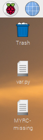
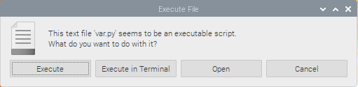
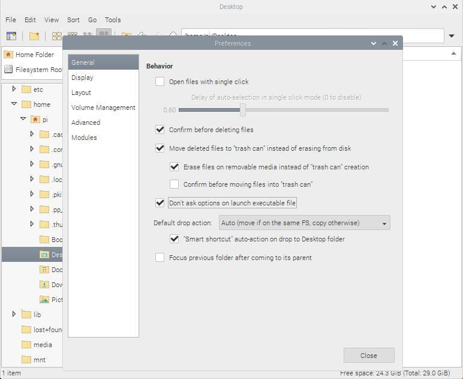
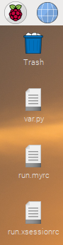
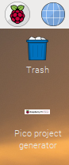

# Shortcut

This notes explains how to create an icon on your desktop or main menu
that you can double-click to execute the underlying program.

There is actually a second issue: the program I wanted to execute used
environment variables, and those appeared not to be available.

The actual use-case is an icon for the pico project generator.


## Test framework

To be in full control, I first wrote my own test application.
I called it `var.py`, I stored it on the desktop, and I made
it executable (`chmod +x var.py`).

```
pi@raspberrypi:~/Desktop $ ls -al
total 12
drwxr-xr-x  2 pi pi 4096 Mar  7 12:31 .
drwxr-xr-x 13 pi pi 4096 Mar  7 12:35 ..
-rwxr-xr-x  1 pi pi  270 Mar  7 12:28 var.py
```

The program itself only uses an environment variable.
The environment variable is called `MYRC`.
It is passed to the `get()` functions, which tries to read the variable.
That function actually returns the string `MYRC=TheValue` when the
environment has a `MYRC` variable with value `TheValue`, or it returns
`MYRC-missing` when the environment does not contain a `MYRC`.

```python
#!/usr/bin/python3
import os

def get(var) :
    try :
        val = var+"="+os.environ[var]
    except :
        val = var+"-missing"
    return val

def put(val) :
	with open("/home/pi/Desktop/"+val,"w") as file :
		file.write(val)
	  
put( get('MYRC') )
```

Since this script is not run from a terminal, the output is
not `print`ed, but rather a file is created on the desktop.
Function `put()` takes care of that. The filename is the 
string returned by `get()`.

We can run this script, and this is the result.



(Wonder how to make [screenshots](https://www.raspberrypi-spy.co.uk/2013/10/how-to-take-screenshots-on-the-raspberry-pi/)?)

The result is as expected; there is no variable `MYRC` yet.


## Configuring double click

We can run `var.py` from a terminal with the commad `./var.py`, or we 
can simply double-click it; after all, it is on the desktop.

However, the latter approach does come up with a dialog



and you either select `Execute` or `Execute in Terminal` - in this case
there is not much difference.

You can get rid of this dialog, but it is a global setting.
In the File Manager, select Edit then Preferences.
In the General tab you place a checkmark for "Don't ask options on launch executable file".




## Environment variables

It looks like we are there.
We can have a Python script, it can read environment variables,
and we can run that script by double clicking it.

There is one catch.
The variable we are going to use is a path to the pico SDK.
This variable will be set/exported in `.bashrc`.

This means that if we run `var.py` from a terminal all is fine.
The terminal runs bash, which sources `.bashrc` which defines the
variable.

However, as Thomas explained, the double-click is different.

The X server and the desktop manager are both usually started by 
the init system and hence inherit the user/group and permissions of 
the init process. When the graphical login comes up and you enter your
user name and password privileges are then dropped to the user's. 

The xserver does not source `.bashrc`. 
What is sourced is `.xsessionrc`.
So whatever you want to have in your environment for your 
X session should be put in there.

If you want to share between `.xsessionrc` and `.bashrc`, put the shared definitions
into e.g. `.myrc` and source that from both `.xsessionrc` and `.bashrc`.

I created `.myrc` and `.xsessionrc` in my home directory, `.bashrc`  was already there.

```bash
pi@raspberrypi:~ $ ls -tal 
total 100
drwxr-xr-x 14 pi   pi   4096 Mar  7 13:35 .
-rw-r--r--  1 pi   pi    291 Mar  7 13:35 .myrc
-rw-r--r--  1 pi   pi    280 Mar  7 13:35 .xsessionrc
...
```

The first file (`.myrc`) defines the variable.

```bash
# /home/pi/.myrc - My common settings, run from .bashrc and.xsessionrc

# Just for test: creates run.myrc on Desktop every startup
touch /home/pi/Desktop/run.myrc 

# The crucial lines go here, the settings common with .bashrc
export MYRC=RUN.MYRC
```

The second one (`.xsessionrc`) sources the first.

```bash
# /home/pi/.xsessionrc - Created to run .myrc with settings common with .bashrc

# Just for test: creates run.xsessionrc on Desktop every startup
touch /home/pi/Desktop/run.xsessionrc 

# The crucial lines go here, source the settings common with .bashrc
. /home/pi/.myrc
```

(Stupid me, I thought `source` would be more readable than `.` in a script. That cost me two hours of my life.)

In both scripts I have added a "debug" line to test if
the script is actually executed.

If we now reboot, the X manager is restarted, and it should
call `.xsessionrc`, which sources `.myrc`. Both run their `touch`
command. As a result, two files should appear on the Desktop.
And they do.



Or, if you prefer the terminal approach

```bash
pi@raspberrypi:~/Desktop $ ls -al
total 12
drwxr-xr-x  2 pi pi 4096 Mar  7 13:40 .
drwxr-xr-x 14 pi pi 4096 Mar  7 13:41 ..
-rw-r--r--  1 pi pi    0 Mar  7 13:40 run.myrc
-rw-r--r--  1 pi pi    0 Mar  7 13:40 run.xsessionrc
-rwxr-xr-x  1 pi pi  257 Mar  7 13:35 var.py
```


## Pico SDK path

After [installing the pico SDK and the project generator utility](../compile), 
I wanted to create an icon for the project generator.
That is actually what this whole readme is about.

The project generator needs the `PICO_SDK_PATH` variable.
This and others are created by the `pico_setup.sh`.

```bash
pi@raspberrypi:~/pico $ env | grep PICO
PICO_EXTRAS_PATH=/home/pi/pico/pico-extras
PICO_SDK_PATH=/home/pi/pico/pico-sdk
PICO_PLAYGROUND_PATH=/home/pi/pico/pico-playground
PICO_EXAMPLES_PATH=/home/pi/pico/pico-examples
```

As it happens, these are appended to `.bashrc`.

```bash
pi@raspberrypi:~ $ tail -4 .bashrc 
export PICO_SDK_PATH=/home/pi/pico/pico-sdk
export PICO_EXAMPLES_PATH=/home/pi/pico/pico-examples
export PICO_EXTRAS_PATH=/home/pi/pico/pico-extras
export PICO_PLAYGROUND_PATH=/home/pi/pico/pico-playground
```

As a result, these variables are not available for the X server,
and thus double-clicking `pico_project.py` doesn't work.
Let's apply the learnings from the previous paragraph.

So, we change the `.myrc` to

```bash
# /home/pi/.myrc - My common settings, run from .bashrc and.xsessionrc

# The crucial lines go here, the settings common with .bashrc
export PICO_SDK_PATH=/home/pi/pico/pico-sdk
export PICO_EXAMPLES_PATH=/home/pi/pico/pico-examples
export PICO_EXTRAS_PATH=/home/pi/pico/pico-extras
export PICO_PLAYGROUND_PATH=/home/pi/pico/pico-playground
```

We can now call that from `.bashrc`. We replace the 4 export lines to
sourcing the `.myrc`.

```bash
# ~/.bashrc: executed by bash(1) for non-login shells.
...

# Added by pico sdk setup script, but moved to .myrc
. /home/pi/.myrc
```

And we do the same for `.xsessionrc`.

```bash
# /home/pi/.xsessionrc - Created to run .myrc with settings common with .bashrc

# The crucial lines go here, source the settings common with .bashrc
. /home/pi/.myrc
```


## Shortcut on Desktop

We can now double-click the project generator, but unfortunately it needs an
additional parameter (`--gui`). Also a dedicated icon (not just Python's) would be nice.

So our last step is to create a "shortcut". Do not confuse this with a (hard or soft) link. 
A shortcut is a file that describes what to run, where, which parameters, what icon, etc.
This is one of the things that is surprisingly hard on linux.
I found hints for [Ubuntu](https://www.howtogeek.com/445303/how-to-create-desktop-shortcuts-on-ubuntu/).

On the `Desktop` create a file that has extension `desktop`, 
e.g. `PicoProjectGenerator.desktop`, with these contents.

```
[Desktop Entry]
Version=1.0
Name=Pico project generator
GenericName=Application to generate an empty project for the Raspberry Pi Pico
Comment=Application to generate an empty project for the Raspberry Pi Pico
Exec=/home/pi/bin/pico-project-generator/pico_project.py --gui
Path=/home/pi/Documents
Icon=/home/pi/bin/pico-project-generator/logo_alpha.gif
Terminal=false
Type=Application
Categories=Application
```

Note that `Exec` has `--gui` as parameter.
Note that `Path` sets the active directory, which is used by the project generator as default "Location".
The `Icon` is a image file used for the shortcut, I decide to use the image that comes with the project generator.

This creates a shortcut on the desktop




## Shortcut in Startmenu

I do not yet know how to create an entry in the "Start menu".

(end)

